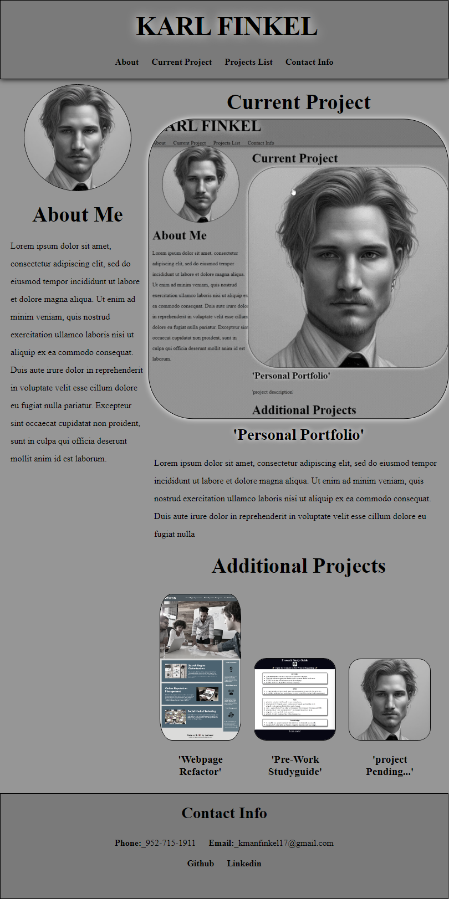

# 02-Advanced-CSS-Challenge-Professional-Portfolio

## Description

- This website was built to display a portfolio of my work via links to my previous and current web development projects. The website is meant to be responsive and user friendly. This project gave me a location to showcase my work and share it with others. I learned core tools of CSS and HTML along with specifics of flexbox, class selectors, links, and element sizing. 

## Installation
- Open link to [my portfolio](https://meister7k.github.io/02-Advanced-CSS-Challenge-Professional-Portfolio/)

## Usage
- Feel free to share link with others. 
- Please do not copy starter code without proper credits 

### screenshot 

## Credits 

- Freepik (nav menue icons)[<a href="https://www.flaticon.com/free-icons/project" title="project icons">Project icons created by Freepik - Flaticon</a>]